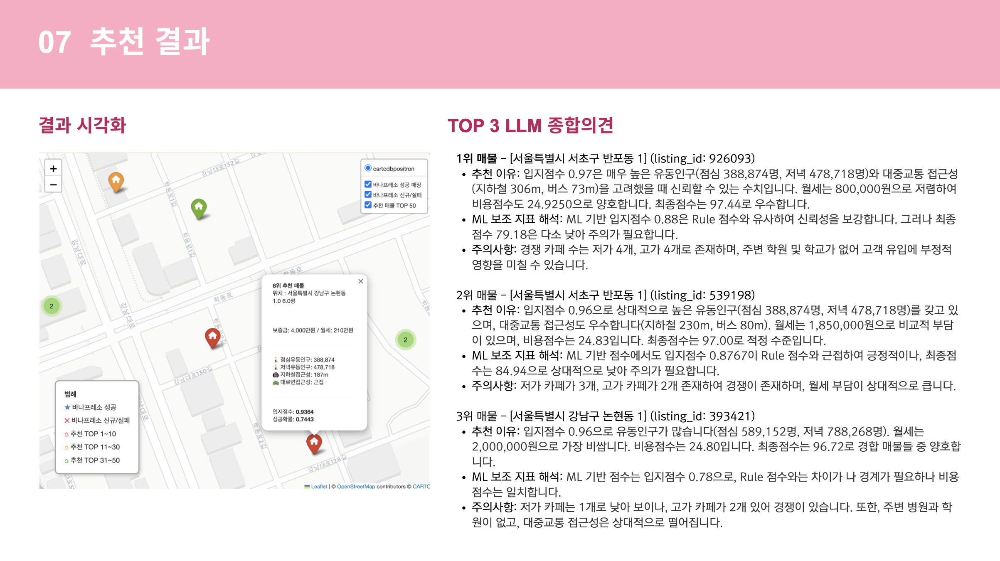

# 바나프레소 신규 입점 입지 추천 시스템

> 기존 바나프레소 매장의 입지 패턴을 분석하여 신규 창업 후보지를 추천하는 **데이터 기반 입지 분석 시스템**
<br>

**팀원:** 김단하 · 김민정 · 조승아 &nbsp;&nbsp;&nbsp; | &nbsp;&nbsp;&nbsp;&nbsp; **기간:** 2026.01.19 ~ 2026.03.06

---

##  프로젝트 개요

대부분의 예비 창업자는 데이터 분석 없이 직관과 경험에 의존해 입지를 결정한다. 본 프로젝트는 서울 내 바나프레소 기존 매장 데이터를 분석해 이상적인 입지 프로파일을 도출하고, 신규 매물을 점수화하여 최적 입점 후보지를 추천한다.

---

## 프로젝트 구조

```
brewmap/
├── crawlers/
│   └── crawl_test/crawl_test/spiders/
│       └── test_zigbang_csv.py              # 직방 크롤링 코드
├── dataAnal/
│   ├── data/
│   │   ├── listing.csv                      # 직방 크롤링 매물 데이터
│   │   ├── listing_scored_rule.csv          # rule-based 점수화 결과
│   │   ├── listing_scored_ml.csv            # ML 점수화 결과
│   │   └── ...                              # 공공데이터 전처리
│   └── analysis/
│       └── BANA_fianl.ipynb   # 최종 분석 코드 (rule-based + ML + LLM)

```

---

## 활용 데이터

| 카테고리 | 출처 | 내용 |
|--------|------|------|
| 유동인구 | 공공데이터포털 | 서울시 상권분석서비스 (2024Q4 ~ 2025Q3) |
| 접근성 | 공공데이터포털 | 지하철역·버스정류장·횡단보도·대로변 정보 |
| 주변 시설 | 공공데이터포털 | 학교·병원·학원·지식산업센터 현황 |
| 경쟁 강도 | 공공데이터포털 | 서울시 휴게음식점 인허가 정보 |
| 매물 | 직방 크롤링 | Scrapy 기반 상업용 매물 (보증금·월세·면적·층수) |
| 바나프레소 | 공공데이터포털 | 서울 내 63개 매장 (영업 59개, 폐업 4개) |

---

## 추천 결과

```
전체 매물 → [1차] recom_score 상위 50% 필터 → [2차] success_prob 내림차순 정렬 → TOP 20
```

<p align="center">
  
</p>

---

## 핵심 인사이트

1. **오피스 상권 중심** — 점심 유동인구가 가장 중요한 변수, 직장인 밀집 지역 출점 패턴 확인
2. **가시성·접근성 핵심** — 대부분 매장이 대로변 + 1층, 지하철역 평균 280m 이내
3. **소비력 기반 전략** — 고가 카페 多 = 소비력 높은 상권 신호, 자사 경쟁 최소화

## 회고


- 학습 데이터 규모가 매우 제한적(59개)이었기 때문에 모델이 성공 패턴을 안정적으로 일반화하기에는 한계가 있었다. 향후에는 바나프레소뿐 아니라 유사 저가 커피 프랜차이즈 데이터를 포함하여 학습 데이터를 수백~수천 건 규모로 확장한다면 모델의 일반화 성능을 개선할 수 있을 것으로 보인다.

- 제한된 데이터 환경을 고려하여 정확한 예측 모델 구축보다는 상권·입지 특성을 정량화하고 매물 추천 구조를 설계하는 데 분석의 초점을 두었다. 이를 통해 유동인구, 접근성, 주변시설, 경쟁 카페 등의 요소를 기반으로 입지 점수를 계산하고, 머신러닝 모델을 활용해 성공 가능성이 높은 매물을 선별하는 추천 구조를 구현하였다.

- Folium을 활용해 기존 바나프레소 매장의 성공·실패 분포와 추천 매물 TOP 50을 하나의 지도에 시각화하여, 공간적 패턴을 직관적으로 확인할 수 있었다. 다만 현재는 정적 HTML 파일로 저장하는 방식이라, 향후 대시보드 형태로 발전시키면 실용성을 높일 수 있을 것이다.

- OpenAI API를 활용해 TOP 3 추천 매물에 대한 자연어 해석을 자동 생성하는 구조를 추가하였다.입지 장점과 리스크를 설명함으로써 추천 결과의 설명 가능성을 높이는 시도였다.

## Personal Development Log
<details>
<summary> Brew Map Development Log </summary>

- [Brew_map-Dev Log](https://www.notion.so/BrewMap-Development-Log-2ea589dece9f8051b657ff8323a35961?source=copy_link)

</details>

