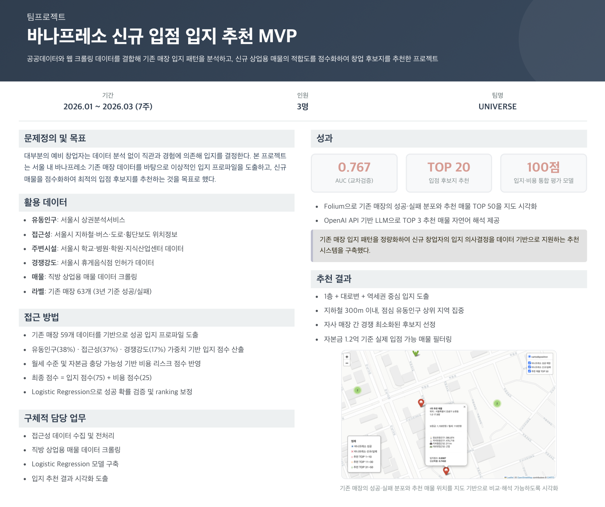

# 바나프레소 신규 입점 입지 추천 시스템

### 공공데이터와 웹 크롤링 데이터 기반 기존 입지 패턴 분석 및 신규 매물 점수화 시스템

  

## 회고

- 학습 데이터 규모가 매우 제한적(59개)이었기 때문에 모델이 성공 패턴을 안정적으로 일반화하기에는 한계가 있었다. 향후에는 바나프레소뿐 아니라 유사 저가 커피 프랜차이즈 데이터를 포함하여 학습 데이터를 수백~수천 건 규모로 확장한다면 모델의 일반화 성능을 개선할 수 있을 것으로 보인다.

- 제한된 데이터 환경을 고려하여 정확한 예측 모델 구축보다는 상권·입지 특성을 정량화하고 매물 추천 구조를 설계하는 데 분석의 초점을 두었다. 이를 통해 유동인구, 접근성, 주변시설, 경쟁 카페 등의 요소를 기반으로 입지 점수를 계산하고, 머신러닝 모델을 활용해 성공 가능성이 높은 매물을 선별하는 추천 구조를 구현하였다.

- Folium을 활용해 기존 바나프레소 매장의 성공·실패 분포와 추천 매물 TOP 50을 하나의 지도에 시각화하여, 공간적 패턴을 직관적으로 확인할 수 있었다. 다만 현재는 정적 HTML 파일로 저장하는 방식이라, 향후 대시보드 형태로 발전시키면 실용성을 높일 수 있을 것이다.

- OpenAI API를 활용해 TOP 3 추천 매물에 대한 자연어 해석을 자동 생성하는 구조를 추가하였다.LLM으로 입지 장점과 리스크를 설명함으로써 추천 결과의 설명 가능성을 높이는 시도였다.

## Personal Development Log

 Brew Map Development Log 

- [Brew_map-Dev Log](https://www.notion.so/BrewMap-Development-Log-2ea589dece9f8051b657ff8323a35961?source=copy_link)

